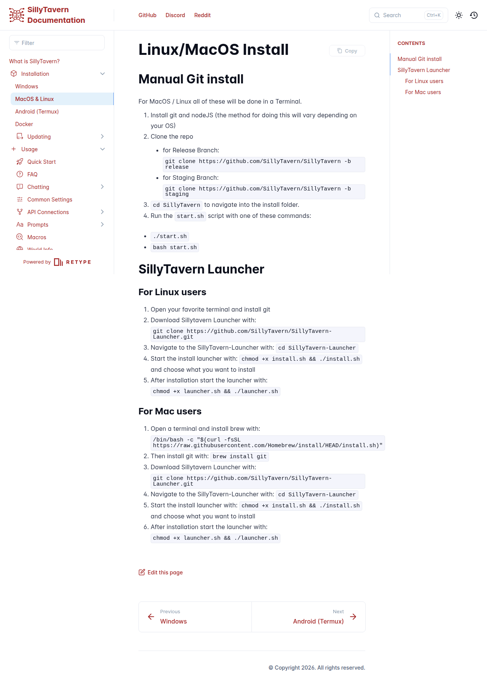

# Visited: https://docs.sillytavern.app/installation/linuxmacos/
**Time:** Tue May 12 11:41:41 UTC 2026

## Screenshot

## Raw HTML
[page.html](./page.html)

## Downloaded Media (0 files)
_No media files downloaded_

## Other Links
- [../../installation/android-(termux)/](../../installation/android-(termux)/)
- [../../installation/windows/](../../installation/windows/)
- [../../resources/css/retype.css?v=4.5.3.831149570726](../../resources/css/retype.css?v=4.5.3.831149570726)
- [../../resources/js/config.js?v=4.5.3.831149570726](../../resources/js/config.js?v=4.5.3.831149570726)
- [../../resources/js/lunr.js?v=4.5.3.831149570726](../../resources/js/lunr.js?v=4.5.3.831149570726)
- [../../resources/js/retype.js?v=4.5.3](../../resources/js/retype.js?v=4.5.3)
- [/static/css/brands.min.css](/static/css/brands.min.css)
- [/static/css/fontawesome.min.css](/static/css/fontawesome.min.css)
- [/static/css/solid.min.css](/static/css/solid.min.css)
- [/static/webfonts/NotoSans/stylesheet.css](/static/webfonts/NotoSans/stylesheet.css)
- [https://discord.gg/sillytavern](https://discord.gg/sillytavern)
- [https://docs.sillytavern.app/](https://docs.sillytavern.app/)
- [https://docs.sillytavern.app/installation/linuxmacos.md](https://docs.sillytavern.app/installation/linuxmacos.md)
- [https://docs.sillytavern.app/installation/linuxmacos/](https://docs.sillytavern.app/installation/linuxmacos/)
- [https://docs.sillytavern.app/sitemap.xml](https://docs.sillytavern.app/sitemap.xml)
- [https://github.com/SillyTavern/SillyTavern](https://github.com/SillyTavern/SillyTavern)
- [https://github.com/SillyTavern/SillyTavern-Docs/edit/main/Installation/LinuxMacOS.md](https://github.com/SillyTavern/SillyTavern-Docs/edit/main/Installation/LinuxMacOS.md)
- [https://retype.com/](https://retype.com/)
- [https://www.reddit.com/r/SillyTavernAI/](https://www.reddit.com/r/SillyTavernAI/)

## Stats
- Links: 22
- Media: 0
